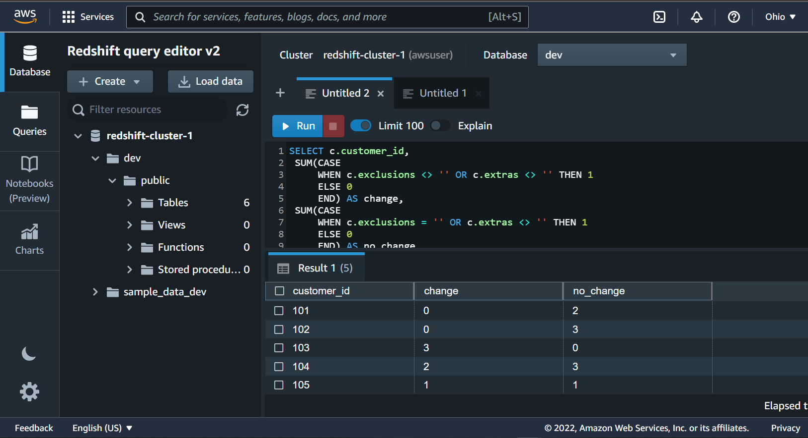

# pizzacon_data_pipeline
Pizzacon is a New pizza house that delivers to customers only. The IT department is still growing with data analyst. But there were problems that needed solutions to help make better analysis 

NOTE!!! This repo solved the Week 2 challenge of Danny Ma SQL 8th week challenege .Solution to all use case question can be found in **'sql.py'** in the **'dags'** folder

Big credits to Danny Ma for this [Danny Ma 8 Weeks challenege](https://8weeksqlchallenge.com/case-study-2/)

### Problem

How can you make analytical work for pizzacon frictionless from a data standpoint and enable data analysts and data scientists to produce great work by exposing as much of the data available to them in a clean and structured form and optimize productivity by reducing run-times.
2. Having all data regarding pizzacon in local db store is risky

### Solution
1. Since query time is important, we leverage cloud data warehousing for faster querying
2. For data backup, we create a staging area that stores all daily recorded data
3. Overall create a pipeline that runs daily and moves data from local db to stage area then to cloud data warehouse

## Tools
1. Postgresql
2. Apache Airflow
3. S3
4. Redshift
5. Docker

## Airchitecture

## Result
The image below display several task that ran successfully

# Airflow dag

# Redshift

